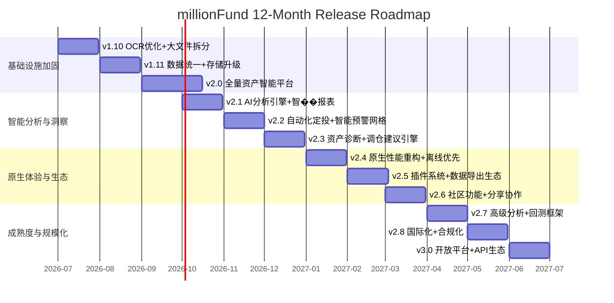

# millionFund 未来 12 个月更新计划

> **起止时间：** 2026 年 7 月 — 2027 年 6 月
> **当前版本：** v1.9.8（已发布）
> **目标版本：** v3.0
> **技术栈：** Vue 3.5 + TypeScript 5.9 + Vite 7 + Vant 4 + Capacitor 7 + Electron 42
> **基于：** `docs/RELEASE_ROADMAP.md` / `FUTURE_ROADMAP.md` / `FUND_MODULE_ROADMAP.md` / `NEWS_MODULE_ROADMAP.md` / `ARCHITECTURE_EVOLUTION.md`

---

## 与现有路线图的关系

本项目 `docs/` 下已有五份路线图文档（`RELEASE_ROADMAP.md` / `FUTURE_ROADMAP.md` / `FUND_MODULE_ROADMAP.md` / `NEWS_MODULE_ROADMAP.md` / `ARCHITECTURE_EVOLUTION.md`，2026-07-02 v0.1 草稿覆盖 v1.10→v2.0 约 10-13 周）。

**其中部分 P0 任务已经完成：**

| 原任务 | 来源 | 当前状态 | 验证依据 |
|--------|------|----------|----------|
| Tesseract `eng` → `chi_sim+eng` | FUTURE §1.1 #1 | ✅ **已完成** | `src/utils/ocr.ts` 已使用 `chi_sim+eng` |
| Canvas 预处理管道（灰度+阈值+去噪） | FUTURE §1.1 #2 | ✅ **已完成** | `preprocessImageForOcr()` 实现 adaptiveThreshold + medianFilter |
| Home.vue 拆分（3,251→5-6 子组件） | ARCH_EVO §3.1 #15 | ✅ **已完成** | 当前 502 行，`src/components/home/` 下 6 个子组件 |
| fundFast.ts 拆分（5 模块） | FUND §4.1 #16 | ✅ **已完成** | 当前仅 71 行，API 已拆入 `fundDetail.ts` / `fundEstimate.ts` / `fundMarket.ts` |

**剩余 P0/P1 未完成**的任务在新的 12 个月计划中重新编排。

---

## 总体���划

---

## 阶段一：基础设施加固（第 1-3 个月）

> **关键词：** 还技术债、提升质量、夯实基础
> **时间：** 2026 年 7 月 — 2026 年 9 月

### v1.10 — OCR 优化 + 大文件拆分（2026-07）

> **前提：** 原 RELEASE_ROADMAP 中的 chi_sim+eng 语言包、Canvas 预处理、Home.vue 拆分、fundFast.ts 拆分 **四项 P0 已完成**。v1.10 聚焦剩余阻塞项。

| # | 模块 | 内容 | 工时 | 优先级 | 来源 |
|---|------|------|------|--------|------|
| 1 | OCR Worker | 共享 Worker 单例复用 + 懒加载（`Tesseract` 每次调用新建 Worker 问题） | 3h | **P0** | FUTURE §1.1 #3 |
| 2 | 文件拆分 | **`Detail.vue`**（2,375 行）→ ChartPanel / FundInfo / HoldingsTable / DividendTimeline / AnnouncementList | 2d | **P0** | — |
| 3 | 文件拆分 | **`Holding.vue`**（2,325 行）→ HoldingTable / HoldingStats / HoldingFilters | 1.5d | **P0** | — |
| 4 | 文件拆分 | **`News.vue`**（1,628 行）→ NewsFeed / NewsCard / NewsFilter / NewsDetail | 1.5d | **P0** | — |
| 5 | 新闻去重 | **合并 `News.vue` + `FinanceNews.vue`**（`/finance-news` 路由仍存在） | 1d | **P0** | NEWS §3.1 #10 |
| 6 | 新闻搜索 | 关键词实时过滤标题/摘要/来源 | 1d | **P0** | NEWS §3.1 #9 |
| 7 | 交叉验证 | Jaccard 相似度替代关键词截断修复 | 4h | **P0** | NEWS §3.1 #11 |
| 8 | OCR 增强 | 多平台截图适配（支���宝/天天基金/蛋卷模板） | 1d | P1 | FUTURE §1.2 #4 |
| 9 | OCR 增强 | 截图质量实时反馈（拉普拉斯方差检测模糊） | 4h | P1 | FUTURE §1.2 #5 |
| 10 | OCR 增强 | 识别失败自动重试（PSM 模式切换） | 4h | P1 | FUTURE §1.2 #6 |
| 11 | OCR 测试 | 真实样张 fixture 测试 | 1d | P1 | FUTURE §4.2 |
| 12 | 缓存键版本化 | 防止版本升级后缓存冲突 | 4h | P1 | FUND §3.0 #17 |
| 13 | 新闻类型 | `NewsSource` 类型更新（4→12 个源） | 1h | P1 | NEWS §3.1 #12 |
| 14 | QDII 标记 | 标记 + 延迟更新逻辑 | 1d | P1 | FUND §4.2.4 #18 |

**总工时：** ~10 人日 | **QA 目标：** Detail/Holding/News 三文件拆分完成（单文件 < 600 行）；OCR Worker 复用后二次识别速度提升 10x；新闻搜索 + 交叉验证修复。

---

### v1.11 — 数据统一 + 存储升级（2026-08）

| # | 模块 | 内容 | 工时 | 优先级 | 来源 |
|---|------|------|------|--------|------|
| 1 | 数据模型 | `UnifiedHolding` 接口，覆盖全部 7 类资产 | 2d | **P0** | ARCH_EVO §3.2 #29 |
| 2 | 汇率转换 | FX 汇率中间层（CNY/USD/HKD → CNY 汇总） | 1d | **P0** | ARCH_EVO §3.2 #32 |
| 3 | 存储升级 | IndexedDB 迁移（替换 localStorage，支持大+结构化） | 2d | **P0** | ARCH_EVO §4 #33 |
| 4 | 新闻 RSS | 替换 mock 为真实 RSS（新浪/腾讯/证券时报/中证/一财） | 1.5d | P1 | NEWS §3.2 #21-25 |
| 5 | Store 拆分 | Portfolio store 独立拆分 | 1d | P1 | ARCH_EVO §3.2 #30 |
| 6 | Store 拆分 | News store 独立创建 | 1d | P1 | ARCH_EVO §3.2 #31 |
| 7 | 性能 | 自选列表首次加载缓存优先 | 1d | P1 | FUND §4.3 #35 |
| 8 | WebSocket | 断线重连 + 心跳机制 | 2d | P1 | — |
| 9 | 新闻缓存 | IndexedDB 缓存最近 200 条 | 1d | P2 | NEWS §3.2 #28 |
| 10 | 基金搜索 | 本地拼音索引 + 最近搜索记忆 | 1d | P2 | FUND §4.3 #37 |

**总工时：** ~13 人日 | **QA 目标：** IndexedDB 读写性能比 localStorage 提升 5x；汇率更新延迟 < 1s；5 个 mock 新闻源替换为真实 RSS。

---

### v2.0 — 全量资产智能平���（2026-09）

> 与 `ARCHITECTURE_v2.md` 中的 v2.0 目标对齐，含现有 `RELEASE_ROADMAP.md` 中 v2.0.x 全部条目。

| # | 模块 | 内容 | 工时 | 优先级 |
|---|------|------|------|--------|
| 1 | OCR 引擎升级 | PaddleOCR.js / ML Kit 替换 Tesseract（取决于调研结论） | 1w | **P0** |
| 2 | 基金对比 | 2-5 只基金横向对比（收益率/回撤/夏普/经理评分），雷达图可视化 | 2d | **P0** |
| 3 | 基金筛选器 | 多条件组合（类型/收益率/风险/规模/评级/经理年限） | 2d | **P0** |
| 4 | DCA 回测 | 定投策略历史回测 + 可视化 | 3d | P1 |
| 5 | AI 新闻摘要 | 接入可配置大模型 API，智能摘要 + 情绪分析 | 3d | P1 |
| 6 | WebSocket | 实时行情推送（金十/财联社） | 3d | P1 |
| 7 | 详情页 K线 | 日/周/月切换 | 2d | P2 |
| 8 | 拖拽排序 | 自选列表拖拽排序 | 1d | P2 |
| 9 | 安全扫描 | CI 集成 CodeQL + Trivy | 1d | P1 |
| 10 | E2E 扩展 | Playwright 覆盖所有核心流程（目标 40+） | 2d | P1 |
| 11 | 性能预算 | Lighthouse FCP < 2s / LCP < 3s / TBT < 200ms | 1d | P2 |
| 12 | PWA 离线 | Service Worker 离线模式完整支持 | 2d | P2 |

> **v2.0 也是原 RELEASE_ROADMAP 的终结版本。** 至此，现有路线图中的所有任务（v1.10 → v1.11 → v2.0）全部落地完毕。

**QA 目标：** OCR 识别速度 < 2s/页；E2E ≥ 40 用例；Lighthouse ≥ 85；CI 安全扫描零告警。

---

## 阶段二：智能分析与洞察（第 4-6 个月）

> **关键词：** AI 驱动、自动化、个性化
> **时间：** 2026 年 10 月 — 2026 年 12 月

### v2.1 — AI 分析引擎 + 智能报表（2026-10）

| # | 模块 | 内容 | 工时 | 优先级 |
|---|------|------|------|--------|
| 1 | 健康度评分 | 基于持仓+市场数据自动生成资产健康度评分（0-100） | 3d | **P0** |
| 2 | 智能报告 | 自动生成月度/季度持仓分析 PDF/HTML 报告 | 3d | **P0** |
| 3 | 智能标签 | 自动打标签（"高波动"、"低估区间"、"行业集中"等） | 2d | P1 |
| 4 | 收益归因 | 分解收益来源：配置贡献 vs 个券选择 vs 时机选择 | 2d | P1 |
| 5 | 风险仪表盘 | VaR / 最大回撤 / 波动率 / 夏普比率 / Beta | 2d | P1 |
| 6 | 自定义看板 | 拖拽配置资产看板布局 | 2d | P1 |
| 7 | 多格式导出 | PDF/CSV/Excel + 定时邮件推送 | 2d | P2 |

**交付物：** 资产健康度评���算法；可配置的报告模板引擎；7 项核心风险指���可视化。

---

### v2.2 — 自动化定投 + 智能预警网格（2026-11）

| # | 模块 | 内容 | 工时 | 优先级 |
|---|------|------|------|--------|
| 1 | 定投管理 | 创建/编辑/暂停/终止定投计划，关联资产和金额 | 3d | **P0** |
| 2 | 定投日历 | 日历视图展示所有定投计划时间线，累计投入 | 2d | **P0** |
| 3 | 网格预警 | 多条件组合预警（价格+波动率+成交量+技术指标） | 3d | **P0** |
| 4 | 多渠道通知 | Web Push + 邮件 + 钉钉/企微 Bot | 2d | P1 |
| 5 | 技术指标 | RSI / MACD / KDJ / 布林带计算引擎 | 2d | P1 |
| 6 | 条件动作 | 预警触发自动动作（发送报告/记录快照/弹窗） | 2d | P2 |

**交付物：** 定投管理全流程；网格预警引擎；5+ 技术指标实时���算。

---

### v2.3 — 资产诊断 + 调仓建议引擎（2026-12）

| # | 模块 | 内容 | 工时 | 优先级 |
|---|------|------|------|--------|
| 1 | 资产诊断 | 仓位集中度/行业暴露/风格漂移/流动性风险 | 3d | **P0** |
| 2 | 调仓建议 | 基于目标配置模型���生成买入/卖出/持有建议 | 3d | **P0** |
| 3 | 再平衡追踪 | 追踪实执行 vs 建议差异，历史记录 | 2d | P1 |
| 4 | 目标配置模型 | 用户设定配置比例（如 60/30/10） | 1d | P1 |
| 5 | What-if 模拟 | 模拟调仓后的资产分布/收益/风险变化 | 2d | P1 |
| 6 | 税费计算 | A 股印花税/基金赎回费/港股通费用模拟 | 2d | P2 |

**交付物：** 资产诊断引擎（10+ 维度）；调仓建议算法；What-if 可视化对比。

---

## 阶段三：原生体验与生态（第 7-9 个月）

> **关键词：** 性能、开放、社区
> **时间：** 2027 年 1 月 — 2027 年 3 月

### v2.4 — 原生性能重构 + 离线优先（2027-01）

| # | 模块 | 内容 | 工时 | 优先级 |
|---|------|------|------|--------|
| 1 | 虚拟列表 | 所有长列表 `vue-virtual-scroller`，万级 60fps | 2d | **P0** |
| 2 | 离线优先 | Service Worker Cache-First + Background Sync | 2d | **P0** |
| 3 | 数据预加载 | 首页关键数据并行预拉取，首屏 < 1s | 2d | **P0** |
| 4 | Capacitor 插件 | 自定义插件（本地通知/文件系统/分享） | 3d | P1 |
| 5 | 冷启动优化 | 减少 TTI（Time to Interactive） | 2d | P1 |
| 6 | 包体积优化 | Tree-shaking + 按需加载 + 图片压缩，APK < 20MB | 2d | P1 |
| 7 | 内存泄漏 | 定时器清理/事件解绑等泄漏点修复 | 1d | P1 |
| 8 | 动画优化 | `requestAnimationFrame` + CSS 硬件加速 | 1d | P2 |

**QA 目标：** Lighthouse Performance ≥ 90；APK 体积 < 20MB；冷启动 < 3s。

---

### v2.5 — 插件系统 + 数据导出生态（2027-02）

| # | 模块 | 内容 | 工时 | 优先级 |
|---|------|------|------|--------|
| 1 | 插件架构 | 插件规范（manifest.json、生命周期、沙箱 API） | 3d | **P0** |
| 2 | 插件市场 | 浏览/安装/启用/禁用/卸载管理界面 | 3d | **P0** |
| 3 | 导出增强 | OFX/QIF/CSV/Excel 多格式，兼容主流理财软件 | 2d | P1 |
| 4 | Webhook | 数据变更推送到外部系统 | 2d | P1 |
| 5 | 数据源 SDK | 降低第三方贡献者���入成本 | 2d | P1 |
| 6 | 自定义主题 | 主题色/字体/布局用户配置 | 2d | P2 |

**交付物：** 插件系统 API 文档 & 示例插件；5+ 数据导出格式；Webhook 集成。

---

### v2.6 — 社区功能 + 分享协作（2027-03）

| # | 模块 | 内容 | 工时 | 优先级 |
|---|------|------|------|--------|
| 1 | 持仓快照 | 生���可分享快照图片/链接（脱敏处理） | 2d | **P0** |
| 2 | 配置模板 | 社区贡献模板（"稳健型 80/20"、"定投沪深 300"） | 2d | P1 |
| 3 | 数据导入 | 同花顺/东方财富/雪球持仓导出文���解析导入 | 2d | P1 |
| 4 | 操作日志 | 本地用户操作审计���志 | 1d | P1 |
| 5 | 匿名排行 | 用户可选加入的匿���收益排行 | 2d | P2 |
| 6 | 社区集成 | GitHub Discussions 嵌入 App | 1d | P2 |

**交付物：** 持仓快照分享功能；5+ 初始配置模板；同花顺/东方财富导入���析器。

---

## 阶段四：成熟度与规模���（第 10-12 个月）

> **关键词：** 深度分析、国际视野、平台生态
> **时间：** 2027 年 4 月 — 2027 年 6 月

### v2.7 — 高级分析 + 回测框架（2027-04）

| # | 模块 | 内容 | 工时 | 优先级 |
|---|------|------|------|--------|
| 1 | 回测引擎 | 自定义历史区间回测，股债配置比例可调 | 3d | **P0** |
| 2 | 蒙特卡洛 | 基于历史数据万次模拟，收益概率分布 | 2d | **P0** |
| 3 | 有效前沿 | Markowitz 有效前沿可视化 | 2d | P1 |
| 4 | 因子分析 | 价值/成长/规模/动量因子暴露��� | 2d | P1 |
| 5 | 相关性矩阵 | 持仓资产相关系数热力图 | 1d | P1 |
| 6 | 压力测试 | 模拟极端情景（2008/2015/2020）下组合表现 | 2d | P1 |

**交付物：** 回测引擎（自定义参数）；蒙特卡洛模拟（10000 次）；有效前沿���表。

---

### v2.8 — 国际化 + 合规化（2027-05）

| # | 模块 | 内容 | 工时 | 优先级 |
|---|------|------|------|--------|
| 1 | i18n 扩展 | 新增日语/韩语/繁体中文，建立社区翻译流程 | 3d | **P0** |
| 2 | 跨境资产 | 美股 W-8BEN 提醒、港股通额度显示 | 2d | P1 |
| 3 | 国际数据源 | Yahoo Finance / Alpha Vantage / Finnhub 接入 | 3d | P1 |
| 4 | 时区处理 | 全平台 UTC 统一，用户时区自动转换 | 1d | P1 |
| 5 | GDPR | 隐私政策 / 数据最小化 / 导出删除功能 | 2d | P1 |
| 6 | 可访问性 | WCAG 2.1 AA / 屏幕阅读器 / 键盘导航 | 2d | P2 |

**交付物：** 3 个新语言包；2+ 国际数据源接���；GDPR 隐私工具集。

---

### v3.0 — 开放平台 + API 生态（2027-06）

| # | 模块 | 内容 | 工时 | 优先级 |
|---|------|------|------|--------|
| 1 | REST API | 只读持仓/资产/净值查询，API Key 鉴权 | 3d | **P0** |
| 2 | OAuth 2.0 | 第三方授权访问用户数据 | 2d | **P0** |
| 3 | 开发者文档 | 独立 docs.millionfund.app，API 参考+SDK+示例 | 3d | **P0** |
| 4 | CLI 工具 | Node.js CLI，命令行查询/导出/回测 | 3d | P1 |
| 5 | 监控平台 | 自建 Sentry / 开源 APM | 2d | P1 |
| 6 | 项目徽章 | 覆盖率/安全/健康度 CI 徽章 | 1d | P2 |

**交付物：** REST API（OpenAPI 3.0 规范）；开发者门户；CLI 工具；监控面板。

---

## 关键指标追踪

| 维度 | 当前状态（v1.9.8） | 12 个月目标（v3.0） |
|------|-------------------|-------------------|
| 代码覆盖率 | 60.73% statements | ≥ 80% |
| E2E 测试数 | 18 | ≥ 60 |
| 单文件最大行数 | 2,375 行（Detail.vue） | ≤ 400 行 |
| Lighthouse 评分 | 未追踪 | ≥ 90 |
| APK 体积 | 未追踪 | < 20MB |
| 冷启动时间 | 未追踪 | < 3s |
| 语言支持 | 2 (zh-CN, en-US) | ≥ 5 |
| 数据源数量 | 37 | ≥ 50 |
| 插件数量 | 0 | ≥ 5（社区贡献） |
| 贡献者 | 1（主要维护者） | ≥ 5（活跃） |

---

## 风险管理

| 风险 | 概率 | 影响 | 缓解措施 |
|------|------|------|----------|
| 金融 API 变更/关闭 | 高 | 高 | 多数据源冗余，每类资产至少 2 个备用源 |
| 大模型 API 成本 | 中 | 中 | AI 功能默认本地模型（WebLLM），云端 API 作为可选项 |
| IndexedDB 兼容性 | 低 | 中 | 降级到 localStorage + 兼容性检测 |
| Electron 更新破坏 | 中 | 中 | 锁定 Electron 版本，升级前跑完整 E2E 测试 |
| 个人开发者精力瓶颈 | 高 | 高 | 优先自动化、社区贡献引导、插���生态降低维护负担 |
| 数据隐私合规风险 | 中 | 高 | 坚守"本地优先"原则，用户数据不���传，开源透明审计 |

---

## 版本发布日历

| 版本 | 预计日期 | 阶段 | 类型 | 关键交付 |
|------|----------|------|------|----------|
| v1.10 | 2026-07-31 | 阶段一 | 质量 | OCR Worker 复用 + 三文件拆分 + 新闻去重/搜索/交叉验证 |
| v1.11 | 2026-08-31 | 阶段一 | 架构 | UnifiedHolding + IndexedDB + 汇率层 + 新闻 RSS 真实化 |
| v2.0 | 2026-09-30 | 阶段一 | ⭐里程碑 | 原路线图收官：PaddleOCR + 对比/筛选/DCA + AI摘要 + 安全扫描 |
| v2.1 | 2026-10-31 | 阶段二 | 功能 | AI 分析引擎 + 智能报表 + 风险仪表盘 |
| v2.2 | 2026-11-30 | 阶段二 | 功能 | 定投管理 + 网格预警 + 技术指标 |
| v2.3 | 2026-12-31 | 阶段二 | 功能 | 资产诊断 + 调仓建议 + What-if 模拟 |
| v2.4 | 2027-01-31 | 阶段三 | 性能 | 虚拟列表 + 离线优先 + 冷启动 < 3s |
| v2.5 | 2027-02-28 | 阶段三 | 生态 | 插件系统 + 多格式导出 + Webhook |
| v2.6 | 2027-03-31 | 阶段三 | 社区 | 持仓快照分享 + 模板市场 + 数据导入 |
| v2.7 | 2027-04-30 | 阶段四 | 分析 | 回测引擎 + 蒙特卡洛 + 有效前沿 |
| v2.8 | 2027-05-31 | 阶段四 | 国际 | 国际化扩展 + 国际数据源 + GDPR |
| v3.0 | 2027-06-30 | 阶段四 | ⭐里程碑 | REST API + 开发者门户 + CLI 工具 |

> **每月一个版本，每月一次 Release。** 小版本迭代、持续交付。
> 每个版本发布后留 1 周收集反馈 + Bug 修复，再启动下个版本开发。

---

## 附录：RELEASE_ROADMAP 任务完成对照

以下列出 `docs/RELEASE_ROADMAP.md`（v0.1-draft, 2026-07-02）中所有 54 项任务的当前状态：

### v1.10.x 基础设施重置

| # | 任务 | P | 来源 | **状态** |
|---|------|:-:|------|----------|
| 1 | Tesseract `eng` → `chi_sim+eng` | P0 | FUTURE §1.1 | ✅ **已完成** |
| 2 | Canvas 预处理管道 | P0 | FUTURE §1.1 | ✅ **已完成** |
| 3 | Worker 单例复用 + 懒加载 | P1 | FUTURE §1.1 | ⏳ 排入 v1.10 |
| 4 | 多平台截图适���模板 | P1 | FUTURE §1.2 | ⏳ 排入 v1.10 |
| 5 | 截图质量实时反馈 | P1 | FUTURE §1.2 | ⏳ 排入 v1.10 |
| 6 | OCR 失败自动重试 | P1 | FUTURE §1.2 | ⏳ 排入 v1.10 |
| 7 | OCR 解析引擎测试 | P1 | FUTURE §4.2 | ⏳ 排入 v1.10 |
| 8 | OCR 组件 i18n 补完 | P2 | FUTURE §3.3 | ⏳ 排入 v1.10 |
| 9 | 新闻页搜索功能 | P0 | NEWS §3.1 | ⏳ 排入 v1.10 |
| 10 | 合并 News + FinanceNews | P0 | NEWS §3.1 | ⏳ 排入 v1.10 |
| 11 | 修复交叉验证算法 | P0 | NEWS §3.1 | ⏳ 排入 v1.10 |
| 12 | 更新 NewsSource 类型 | P1 | NEWS §3.1 | ⏳ 排入 v1.10 |
| 13 | FinanceNews 迁移 TS | P1 | NEWS §3.1 | ⏳ 排入 v1.10 |
| 14 | FinanceNews i18n 补全 | P1 | NEWS §3.1 | ⏳ 排入 v1.10 |
| 15 | Home.vue 拆分 | P0 | ARCH_EVO §3.1 | ✅ **已完成** |
| 16 | fundFast.ts 拆分 | P0 | FUND §4.1 | ✅ **已完成** |
| 17 | 缓存键版本化 | P1 | FUND §3.0 | ⏳ 排入 v1.10 |
| 18 | QDII 基金标记 | P1 | FUND §4.2.4 | ⏳ 排入 v1.10 |
| 19 | TypeScript strict 清零 | P1 | ARCH_EVO §3.1 | ✅ v1.9.8 CHANGELOG 已确认全量通过 |
| 20 | 非交易时间状���栏 | P2 | FUND §3.0 | ⏳ 排入 v1.10 |

### v1.11.x 数据统一

| # | 任务 | P | 来源 | **状态** |
|---|------|:-:|------|----------|
| 21-25 | 新闻 RSS 替换 mock（5 个源） | P1 | NEWS §3.2 | ⏳ 排入 v1.11 |
| 26 | 今日头条/同花顺数据调研 | P2 | NEWS §3.2 | ⏳ 排入 v1.11 |
| 27 | 新闻缓存 IndexedDB | P2 | NEWS §3.2 | ⏳ 排入 v1.11 |
| 28 | 新闻分类筛选 | P2 | NEWS §3.2 | ⏳ 排入 v1.11 |
| 29 | UnifiedHolding 模型 | P1 | ARCH_EVO §3.2 | ⏳ 排入 v1.11 |
| 30 | Portfolio store 拆分 | P1 | ARCH_EVO §3.2 | ⏳ 排入 v1.11 |
| 31 | News store 创建 | P1 | ARCH_EVO §3.2 | ⏳ 排入 v1.11 |
| 32 | 汇率转换层 | P1 | ARCH_EVO §3.2 | ⏳ 排入 v1.11 |
| 33 | IndexedDB 迁移 | P2 | ARCH_EVO §4 | ⏳ 排入 v1.11 |
| 34 | 详情页同类平均对比 | P2 | FUND §4.2.5 | ⏳ 排入 v1.11 |
| 35 | 自选列表缓存优先 | P1 | FUND §4.3 | ⏳ 排入 v1.11 |
| 36 | 持仓增量汇总计算 | P2 | FUND §4.3 | ⏳ 排入 v1.11 |
| 37 | 基金搜索本地索引 | P2 | FUND §4.3 | ⏳ 排入 v1.11 |

### v2.0.x 全品种平台

| # | 任务 | P | **状态** |
|---|------|:-:|----------|
| 38 | PaddleOCR.js 替换 | P2 | ⏳ 排入 v2.0 |
| 39 | 多资产截图识别 | P2 | ⏳ 排入 v2.0 |
| 40 | 批量导入+去重 | P2 | ⏳ 排入 v2.0 |
| 41 | 自选资产资讯标记 | P2 | ⏳ 排入 v2.0 |
| 42 | 新闻时间线视图 | P3 | ⏳ 排入 v2.0 |
| 43 | WebSocket 实时推送 | P2 | ⏳ 排入 v2.0 |
| 44 | 基金对比工具 | P1 | ⏳ 排入 v2.0 |
| 45 | 基金筛选器 | P1 | ⏳ 排入 v2.0 |
| 46 | 定投模拟器 | P2 | ⏳ 排入 v2.0 |
| 47 | 详情页 K线切换 | P2 | ⏳ 排入 v2.0 |
| 48 | 自选列表拖拽排序 | P2 | ⏳ 排入 v2.0 |
| 49 | WebSocket 行情推送 | P2 | ⏳ 排入 v2.0 |
| 50 | PWA 离���完整 | P2 | ⏳ 排入 v2.0 |
| 51 | E2E 测试补全 | P1 | ⏳ 排入 v2.0 |
| 52 | CI 安全扫描 CodeQL/Trivy | P2 | ⏳ 排入 v2.0 |
| 53 | Electron 多窗口 | P3 | ⏳ 排入 v2.0 |
| 54 | 资产数据导入导出 | P2 | ⏳ 排入 v2.0 |

**汇总：** ✅ 已完成 4 项（#1, #2, #15, #16）+ 1 项（#19 已在 v1.9.8 完成）

---

## 附录：与现有路线图的版本对齐

| 现有文档 | 规划范围 | 本计划中的位置 |
|----------|---------|---------------|
| `RELEASE_ROADMAP.md` | v1.10 → v1.11 → v2.0（10-13 周） | 阶段一（月 1-3），v2.0 为原路线图终点 |
| `FUTURE_ROADMAP.md` | OCR + 数据层 + UI + 性能 + 安全 | 分散在阶段一（OCR/数据层）+ 阶段三（性能） |
| `FUND_MODULE_ROADMAP.md` | fundFast 拆分 + 对比/筛选/定投 | fundFast 拆分已 ✅ 完成；对比/筛选/定投 → v2.0 |
| `NEWS_MODULE_ROADMAP.md` | 搜索/合并/交叉验证 + RSS 真实化 | 搜索/合并/交叉验证 → v1.10；RSS → v1.11 |
| `ARCHITECTURE_EVOLUTION.md` | 代码拆分 + 数据层 + 存储 + 测试 | 代码拆分（Home/fundFast）✅ 已完成；数据��� → v1.11；存储 → v1.11 |
| `ARCHITECTURE_v2.md` | 目标架构蓝图 | 贯穿始终的架构目标 |
| ADR-001（免费数据源） | — | 贯穿始终，新增国际源时遵循免费优��� |
| ADR-002（不交易） | — | 贯穿始终，不做交易执行功能 |
| ADR-003（本地存储） | — | v1.11 IndexedDB 本地化 + v2.8 GDPR 合规增强 |
